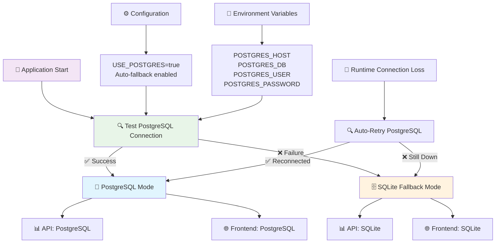

# 🗄️ Architecture des Bases de Données - Système Hybride

## 📋 Vue d'ensemble

Le projet utilise une **architecture hybride intelligente** avec PostgreSQL comme base principale et SQLite comme solution de fallback automatique. Cette approche garantit la résilience et la flexibilité selon les environnements.

## 🏗️ Diagrammes d'Architecture

### Diagramme détaillé du système de fallback

> 📁 **Source** : `docs/database_architecture_diagram.mmd`  
> 🖼️ **Image** : Générer avec `./scripts/generate_diagrams.sh` ou [Mermaid Live](https://mermaid.live/)



## 🎯 Stratégie de Fallback

### Principe
1. **Test automatique** de la connexion PostgreSQL au démarrage
2. **Basculement transparent** vers SQLite si PostgreSQL indisponible
3. **Retour automatique** à PostgreSQL dès qu'il redevient disponible
4. **Surveillance continue** des connexions avec `pool_pre_ping`

### Avantages
- ✅ **Résilience** : Pas d'interruption de service
- ✅ **Flexibilité** : Fonctionne en développement et production
- ✅ **Performance** : PostgreSQL quand disponible, SQLite en secours
- ✅ **Simplicité** : Configuration automatique

## ⚙️ Configuration

### Variables d'environnement

```bash
# Configuration PostgreSQL
POSTGRES_HOST=db
POSTGRES_DB=bankreports
POSTGRES_USER=postgres
POSTGRES_PASSWORD=postgres
POSTGRES_PORT=5432

# Activation du système hybride
USE_POSTGRES=true  # Active le test automatique
```

### Fichiers de configuration

#### API FastAPI (`src/db/database.py`)
```python
# Test automatique de connexion
if USE_POSTGRES and test_postgres_connection():
    # PostgreSQL disponible
    engine = create_engine(postgresql_url)
else:
    # Fallback SQLite
    engine = create_engine(sqlite_url)
```

#### Frontend Django (`frontend/frontend/settings.py`)
```python
# Même logique pour Django
if USE_POSTGRES and test_postgres_connection():
    DATABASES = postgresql_config
else:
    DATABASES = sqlite_config
```

## 🔧 Utilisation

### Vérification du statut

```bash
# Script de vérification
python check_database_status.py

# Endpoint API
curl http://localhost:8000/api/database-info
```

### Simulation du fallback

```bash
# Test du fallback
docker stop finalprojectsimplon-db-1  # Arrêt PostgreSQL
docker restart finalprojectsimplon-api-1  # Redémarrage API
# → L'API bascule automatiquement sur SQLite

# Test du retour
docker start finalprojectsimplon-db-1  # Redémarrage PostgreSQL
docker restart finalprojectsimplon-api-1  # Redémarrage API
# → L'API revient automatiquement sur PostgreSQL
```

## 📊 Comparaison des Bases

| Caractéristique | PostgreSQL | SQLite |
|-----------------|------------|--------|
| **Performance** | ⭐⭐⭐⭐⭐ | ⭐⭐⭐ |
| **Concurrence** | ⭐⭐⭐⭐⭐ | ⭐⭐ |
| **Simplicité** | ⭐⭐⭐ | ⭐⭐⭐⭐⭐ |
| **Fonctionnalités** | ⭐⭐⭐⭐⭐ | ⭐⭐⭐ |
| **Déploiement** | ⭐⭐⭐ | ⭐⭐⭐⭐⭐ |
| **Résilience** | ⭐⭐⭐ | ⭐⭐⭐⭐⭐ |

## 🚀 Cas d'utilisation

### 🏭 Production
- **Principal** : PostgreSQL pour les performances
- **Secours** : SQLite en cas de problème PostgreSQL
- **Monitoring** : Surveillance automatique des connexions

### 💻 Développement
- **Local** : SQLite pour la simplicité
- **Docker** : PostgreSQL pour la fidélité production
- **Tests** : SQLite isolé

### 🔄 CI/CD
- **Tests unitaires** : SQLite rapide
- **Tests d'intégration** : PostgreSQL
- **Déploiement** : Configuration automatique selon l'environnement

## 📈 Monitoring et Logs

### Logs d'information
```
🐘✅ Connexion PostgreSQL réussie: db
🗄️ Base de données: SQLite (./bankreports.db)
🔄 Basculement automatique vers SQLite
```

### Endpoints de monitoring
- `GET /api/database-info` : Informations sur la base utilisée
- `GET /health` : Santé générale de l'API

## 🛠️ Maintenance

### Migration des données
- Les migrations Alembic fonctionnent avec les deux bases
- Synchronisation automatique des schémas
- Sauvegarde recommandée avant basculement

### Bonnes pratiques
1. **Tester régulièrement** le fallback
2. **Surveiller les logs** de connexion
3. **Maintenir les deux schémas** synchronisés
4. **Sauvegarder SQLite** en cas d'utilisation prolongée

## 🔗 Références

- [PostgreSQL Documentation](https://www.postgresql.org/docs/)
- [SQLite Documentation](https://www.sqlite.org/docs.html)
- [SQLAlchemy Connection Pooling](https://docs.sqlalchemy.org/en/20/core/pooling.html)
- [Django Database Configuration](https://docs.djangoproject.com/en/4.2/ref/settings/#databases)

---

> 💡 **Note** : Cette architecture hybride offre le meilleur compromis entre performance, résilience et simplicité de déploiement. 